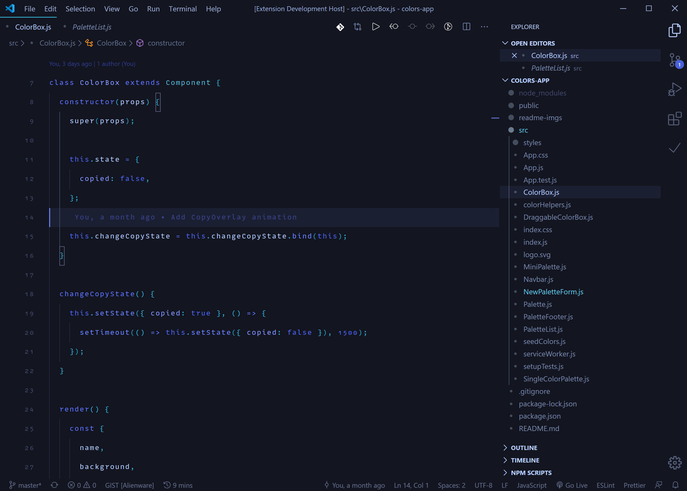
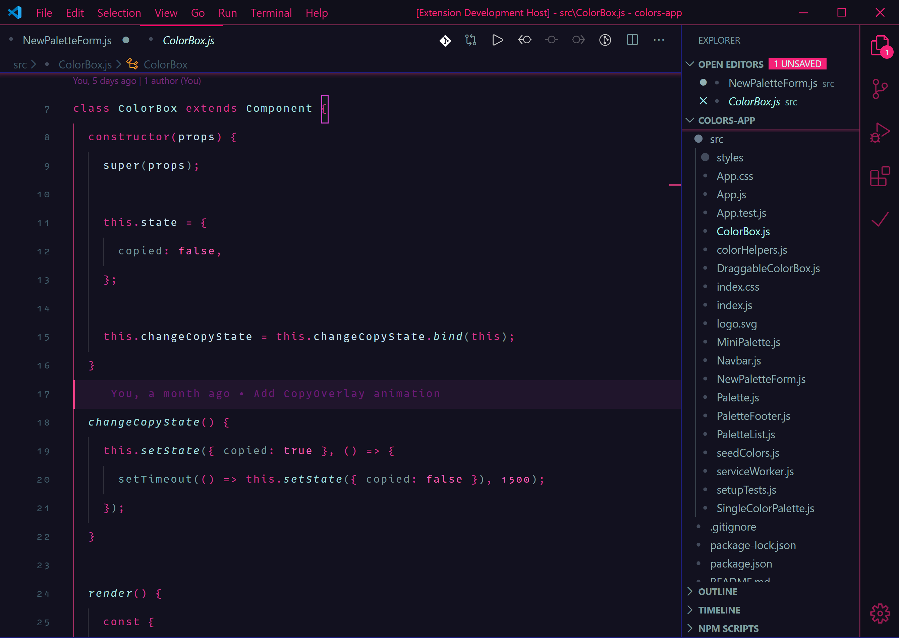
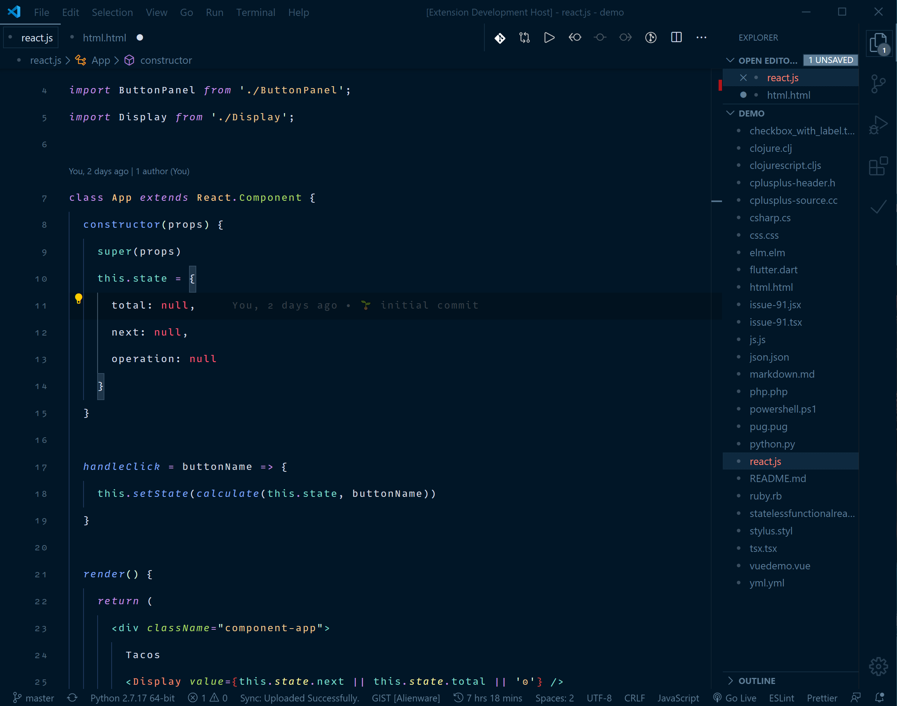
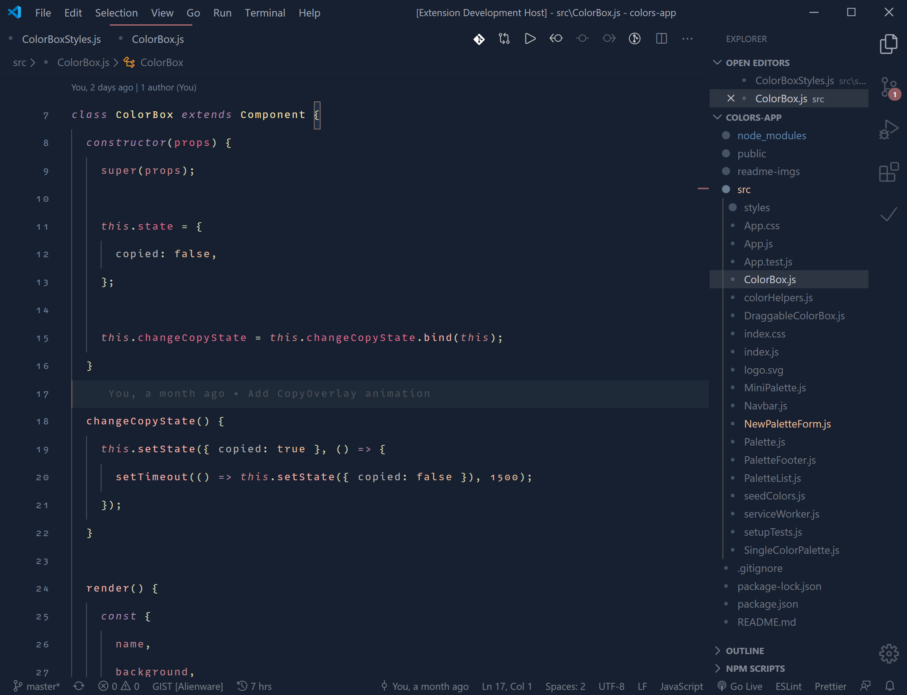
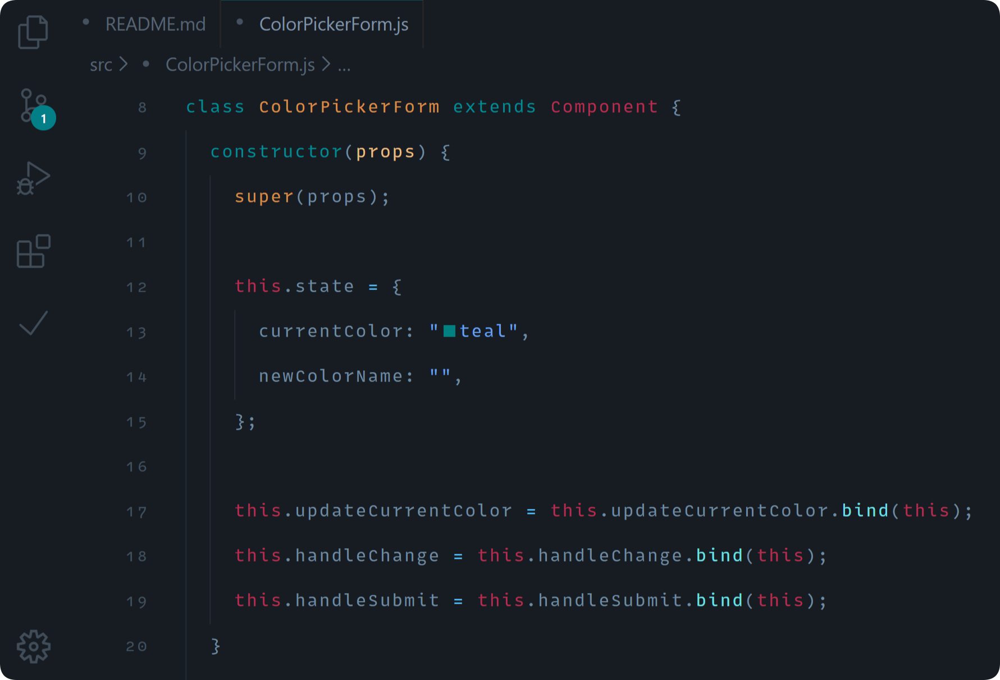
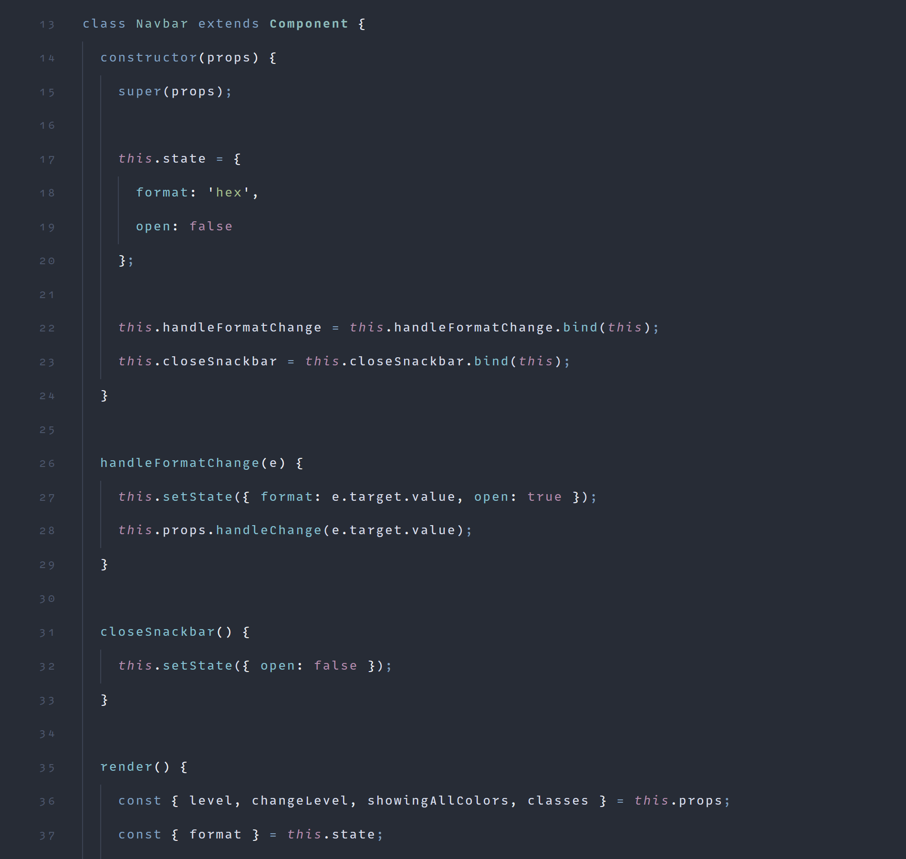

# August Themes

🌬 ‧˙ᕀ ✧‧˙༝‧ ᣞ ᱸ༝ ∘ ‧ **Visual Studio Code** themes modified to ~~almost~~ perfection ‧˙ᕀ ✧‧˙༝‧ ᣞ ᱸ༝ ∘ ‧

   

  
  
  
  
  
  

## Installation

1.  Install [Visual Studio Code](https://code.visualstudio.com/)
2.  Launch Visual Studio Code
3.  Choose **Extensions** from menu
4.  Search for `august themes`
5.  Click **Install** to install it
6.  Click **Reload** to reload the Code
7.  From the menu bar click: Code > Preferences > Color Theme > **August - [version]**

## Credits

[Base2Tone](https://marketplace.visualstudio.com/items?itemName=Atelierbram.base2tone-vscode-themes)
 
[City Lights](https://marketplace.visualstudio.com/items?itemName=Yummygum.city-lights-theme)
 
[Night Owl](https://marketplace.visualstudio.com/items?itemName=sdras.night-owl)
 
[Nord](https://marketplace.visualstudio.com/items?itemName=arcticicestudio.nord-visual-studio-code)
 
[Radical](https://marketplace.visualstudio.com/items?itemName=dhedgecock.radical-vscode)
 
[Rouge](https://marketplace.visualstudio.com/items?itemName=josef.rouge-theme)

 

🔠 Font used in demos - [Gintronic](https://bboxtype.com/typefaces/Gintronic/#!layout=specimen)
 
🌸 Icon made by <a href="https://www.flaticon.com/authors/smashicons" title="Smashicons">Smashicons</a> from <a href="https://www.flaticon.com/" title="Flaticon"> www.flaticon.com</a>
