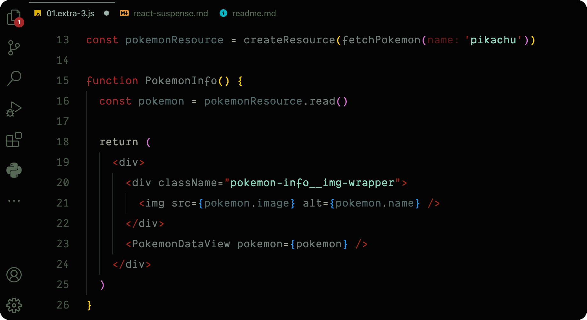

 

<h1 style="border-bottom: none; text-transform: uppercase; letter-spacing: 4px";>August Themes</h1>

<h4 style="letter-spacing: 0.5px">
  ‧˙ᕀ ✧‧˙༝‧ ᣞ ᱸ༝ ∘ ‧  Dark **Visual Studio Code** themes modified to ~~almost~~ perfection ‧˙ᕀ ✧‧˙༝‧ ᣞ ᱸ༝ ∘ ‧
</h4>

 

<h4 style="letter-spacing: 2px; text-transform: uppercase">Drawbridge</h4>

<h4 style="letter-spacing: 2px; text-transform: uppercase">Radical</h4>

<h4 style="letter-spacing: 2px; text-transform: uppercase">City Lights</h4>

<h4 style="letter-spacing: 2px; text-transform: uppercase">Arstotzka</h4>

<h5 style="letter-spacing: 0.5px">
  ‧˙ᕀ ✧‧˙༝‧ ᣞ ᱸ༝ ∘ ‧  When it is dark enough, you can see the stars. ‧˙ᕀ ✧‧˙༝‧ ᣞ ᱸ༝ ∘ ‧
</h5>

<h4 style="letter-spacing: 1px; text-transform: uppercase"><a href="CREDITS.md" >Credits</a></h4>

