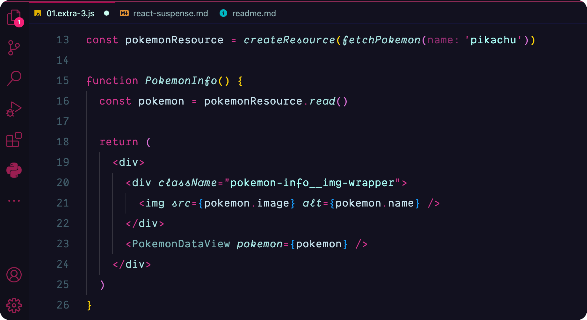

# August Themes

My favorite **Visual Studio Code** themes slightly modified.

## Credits

[City Lights](https://marketplace.visualstudio.com/items?itemName=Yummygum.city-lights-theme)
 
[Night Owl](https://marketplace.visualstudio.com/items?itemName=sdras.night-owl)
 
[Nord](https://marketplace.visualstudio.com/items?itemName=arcticicestudio.nord-visual-studio-code)
 
[Radical](https://marketplace.visualstudio.com/items?itemName=dhedgecock.radical-vscode)
 
[Rouge](https://marketplace.visualstudio.com/items?itemName=josef.rouge-theme)

 

🔠 Font used in demos - [Gintronic](https://bboxtype.com/typefaces/Gintronic/#!layout=specimen)
 
🌸 <a target="_blank" href="https://icons8.com/icons/set/picture-in-picture">Picture in Picture</a> icon by <a target="_blank" href="https://icons8.com">Icons8</a>
