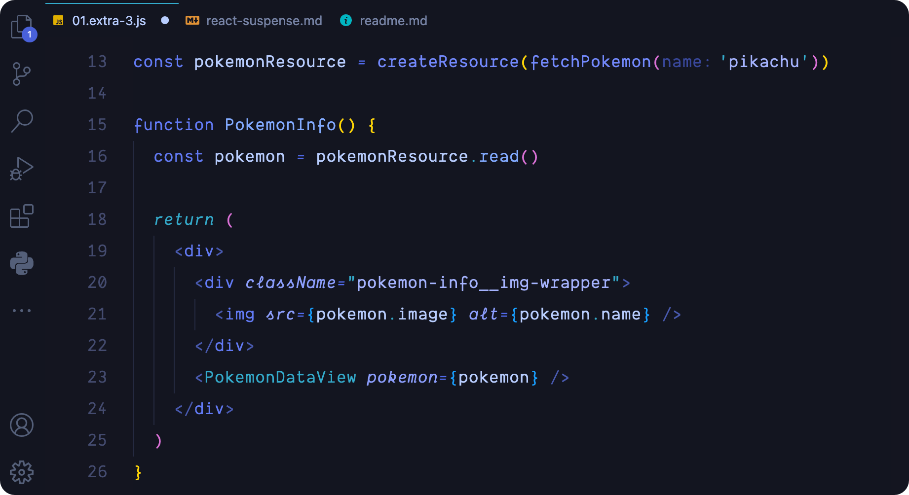
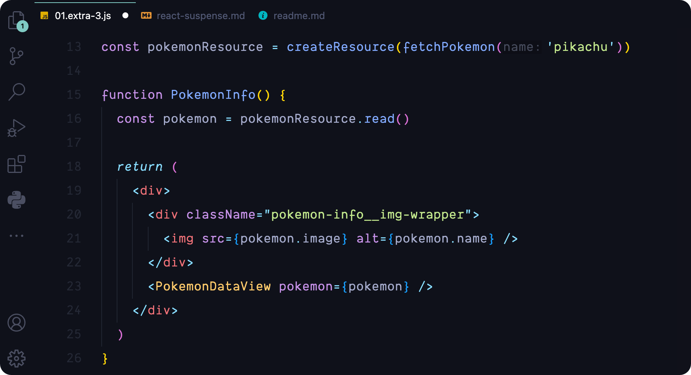
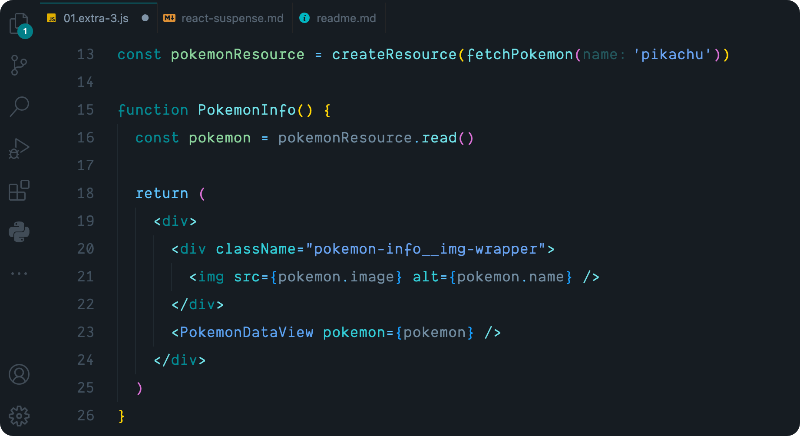
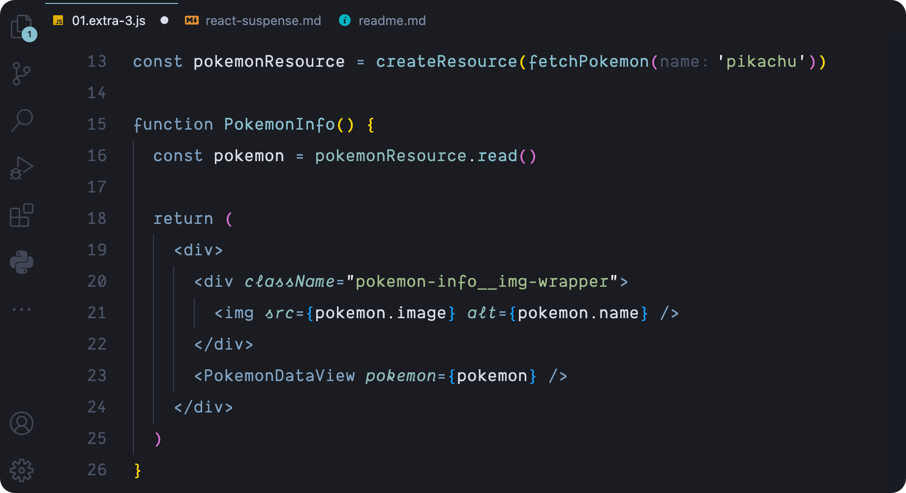
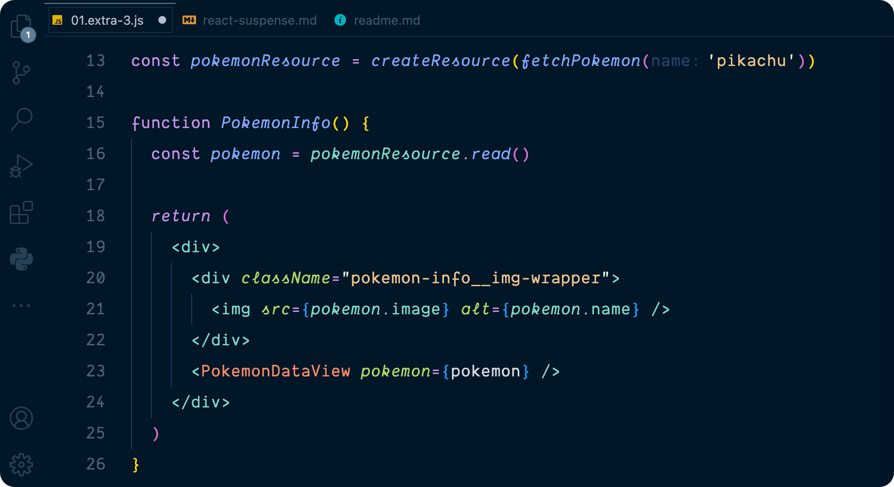

 

<h1 style="border-bottom: none; text-transform: uppercase; letter-spacing: 4px";>August Themes</h1>

‧ ˙ᕀ ✧ᱸ༝ ‧  Dark Visual Studio Code themes modified to <del>almost</del> perfection ‧ ˙ᕀ ✧ᱸ༝ ‧

 

<h4 style="letter-spacing: 2px; text-transform: uppercase">Drawbridge</h4>

<h4 style="letter-spacing: 2px; text-transform: uppercase">Radical</h4>

<h4 style="letter-spacing: 2px; text-transform: uppercase">Material Ocean</h4>

<h4 style="letter-spacing: 2px; text-transform: uppercase">Arstotzka</h4>

<h4 style="letter-spacing: 2px; text-transform: uppercase">City Lights</h4>

<h4 style="letter-spacing: 2px; text-transform: uppercase">Nord</h4>

<h4 style="letter-spacing: 2px; text-transform: uppercase">Night Owl</h4>

<h4 style="letter-spacing: 2px; text-transform: uppercase">Rosé Pine</h4>

<h4 style="letter-spacing: 2px; text-transform: uppercase"><a href="https://tinyurl.com/yctt6ko8" >Credits</a></h4>

